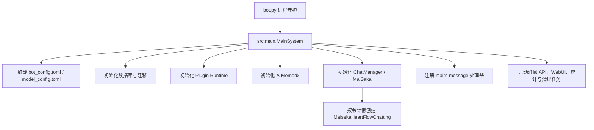
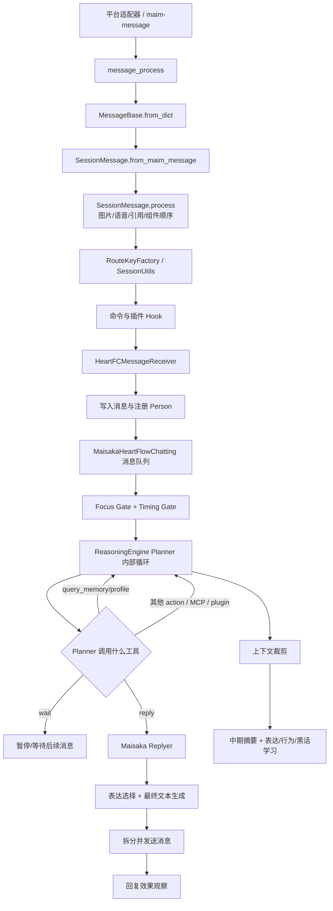
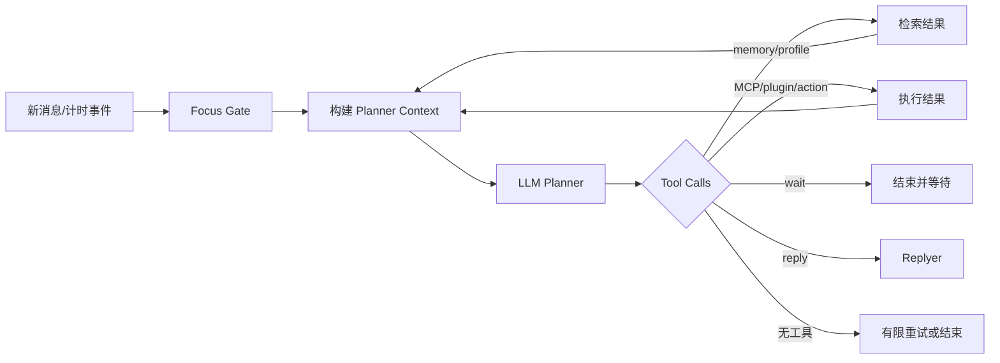
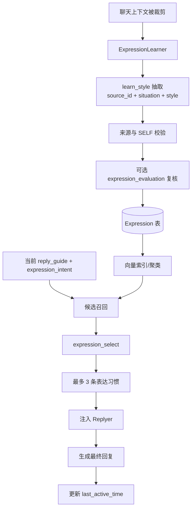
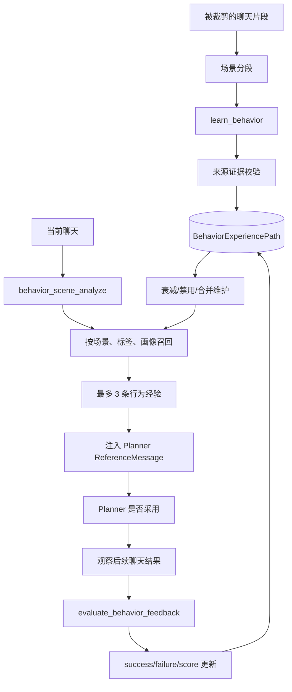
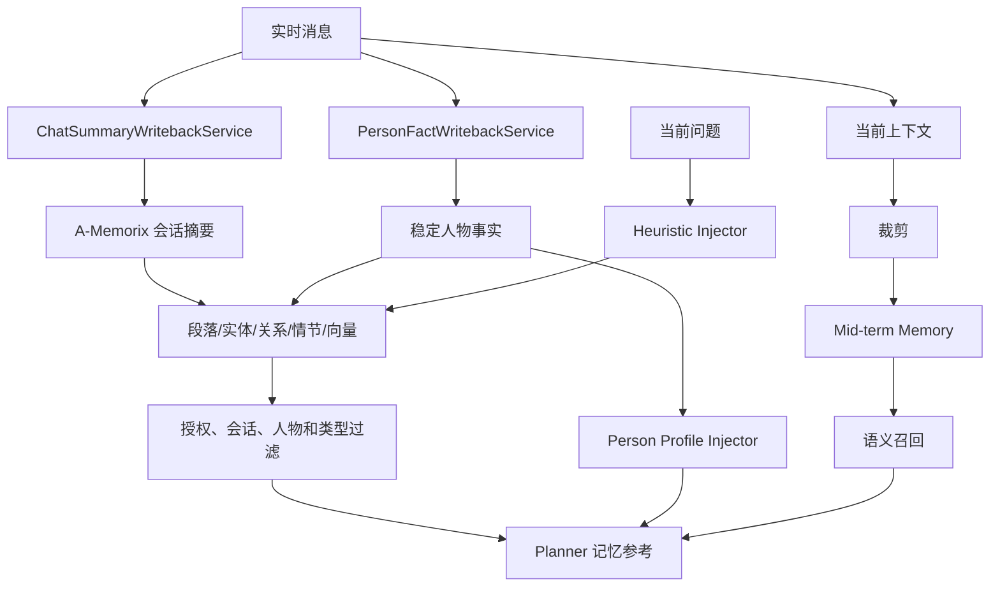
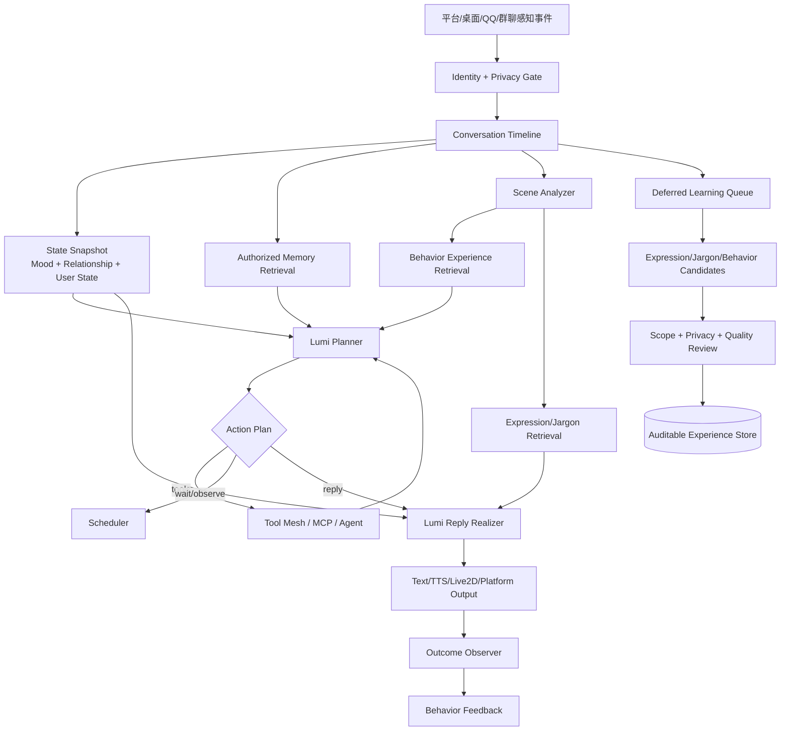

# MaiBot 整体架构

## 研究范围与版本

本文研究对象为 `Mai-with-u/MaiBot` 的 `main` 分支，固定到以下源码版本：

- Commit：`d7b19250a54b1fa15884bdf7d227ef72722da131`
- Commit 时间：2026-07-23 02:55:27 UTC
- `pyproject.toml` 项目版本：`1.1.0`
- Python 要求：`>=3.12`

本文中的“源码事实”均来自上述版本。最后两章中的“建议”是面向 Lumi 的设计推导，不代表 MaiBot 已经实现这些能力。

本次研究不仅检查了 README 和 Prompt，还沿着启动入口、消息接收、会话运行时、Planner、工具、Replyer、学习器、A-Memorix、数据库和插件运行时追踪了真实调用链。

## 技术组成

MaiBot 主体是 Python 项目。核心依赖可在 `pyproject.toml` 中确认：

- 消息协议：`maim-message==0.6.8`
- 数据模型与 ORM：SQLModel、SQLAlchemy
- 主数据库：SQLite
- 向量检索：FAISS、NumPy、SciPy
- 模型接口：OpenAI、Google GenAI、HTTPX
- Web 管理：FastAPI、Uvicorn、独立 Dashboard 包
- 工具协议：MCP
- 插件：`maibot-plugin-sdk` 和隔离插件运行时
- 浏览器能力：Playwright

项目并非“QQ 事件直接调用一次 LLM”。它由以下几层组成：

| 层 | 目录/文件 | 职责 |
|---|---|---|
| 进程入口 | `bot.py`、`src/main.py` | 进程守护、配置、组件初始化、后台任务 |
| 平台消息层 | `src/chat/message_receive/`、`src/platform_io/` | 解析平台消息、媒体、会话和发送者 |
| 会话层 | `src/chat/message_receive/chat_manager.py` | 创建和恢复聊天会话、保存近期上下文 |
| Agent 运行时 | `src/maisaka/runtime.py` | 每个会话的队列、状态、内部思考轮次和学习触发 |
| 注意力层 | `src/maisaka/focus/` | 控制当前重点会话、冷却和跨会话切换 |
| Planner | `src/maisaka/reasoning_engine.py`、`src/maisaka/chat_loop_service.py` | 决定下一步行动、选择工具、继续或结束内部循环 |
| 工具层 | `src/maisaka/builtin_tool/`、`src/core/tooling.py` | reply、wait、memory、profile、MCP、插件工具 |
| Replyer | `src/chat/replyer/` | 根据明确回复目标和表达习惯生成最终可见文本 |
| 学习层 | `src/learners/` | 表达、行为、黑话和高频词学习 |
| 记忆层 | `src/services/memory_*`、`src/A_memorix/` | 摘要、人物事实、关系图、向量和情节检索 |
| 人物层 | `src/person_info/` | 平台用户到稳定人物标识的映射 |
| 插件层 | `src/plugin_runtime/`、`src/plugins/` | 隔离插件进程、Hook、能力和工具注册 |
| 配置层 | `src/config/` | TOML 配置、版本迁移、热重载 |
| 持久化层 | `src/common/database/` | SQLModel 表、SQLite WAL、Schema 迁移 |

## 启动流程



关键位置：

- `bot.py`：父进程监督工作进程，退出码 `42` 用于请求重启。
- `src/main.py::MainSystem._init_components`：初始化配置监视、插件、A-Memorix、Prompt、聊天和记忆自动化。
- `src/main.py::MainSystem._register_message_handlers`：把 `chat_bot.message_process` 注册到消息 API。
- `src/main.py::MainSystem.schedule_tasks`：启动消息服务、清理和统计等长期任务。
- `saka.py` 是独立 CLI 入口，不是普通平台消息的主入口。

## 配置与数据边界

`src/config/config.py::ConfigManager` 管理：

- `config/bot_config.toml`
- `config/model_config.toml`
- 配置版本升级
- 文件监视与热重载

`src/common/database/database.py` 将主数据库固定为 `data/MaiBot.db`，使用：

- SQLite WAL
- `foreign_keys=ON`
- `synchronous=NORMAL`
- SQLModel
- 启动期 Schema 迁移

A-Memorix 在主业务表之外维护段落、实体、关系、人物画像、情节、向量回填和反馈任务等数据。表达效果跟踪还会写入 `logs/maisaka_reply_effect/` 下的 JSON。因此 MaiBot 的长期状态并不只存在于一个聊天历史表。

# 核心运行流程

## 一次消息的真实链路



### 消息入口

`src/chat/message_receive/bot.py::message_process` 接收字典并构造 `maim-message` 的 `MessageBase`，随后转成 `SessionMessage`。

`src/chat/message_receive/message.py::SessionMessage` 保留消息组件，而不是提前压成一个字符串，支持：

- Text
- Image
- Emoji
- At
- Voice
- File
- Reply
- ForwardNode

图片可延迟执行视觉理解，语音可根据配置进入 ASR。群聊和私聊会通过 `RouteKeyFactory`、`SessionUtils` 生成不同会话键。

### 身份与会话

`src/chat/message_receive/chat_manager.py` 中：

- `BotChatSession` 表示运行时会话。
- `ChatManager` 负责创建、恢复、缓存和保存会话。
- 群聊会话不把某一个发言人固化成整个会话的唯一人物。

`src/chat/heart_flow/heartflow_message_processor.py` 会：

1. 保存消息。
2. 注册聊天。
3. 调用 `Person.register_person` 同步人物身份。
4. 将消息交给会话运行时。

`src/chat/heart_flow/heartflow_manager.py` 为每个会话懒创建一个 `MaisakaHeartFlowChatting`。创建有锁保护，运行时缓存带 LRU 和超时清理。

### 为什么不是直接回复

MaiBot 在生成文字前先解决三个不同问题：

1. **是否值得介入**：Timing Gate、Focus Gate。
2. **下一步做什么**：Planner 与工具。
3. **具体怎么说**：Replyer 与表达选择。

这使“看见消息”“决定参与”“决定动作”和“形成语言”不必由同一次模型调用混在一起。

# Planner 系统

## Planner 的职责

Planner 的核心不是写最终回复，而是维护一个可多轮执行的内部行动循环：

- 阅读当前聊天和运行时参考信息。
- 判断是否查询记忆或人物画像。
- 调用业务、MCP 或插件工具。
- 等待更多消息。
- 切换关注会话。
- 最终选择 `reply` 工具并给 Replyer 提供回复目标和指导。

核心实现：

- `src/maisaka/reasoning_engine.py::ReasoningEngine.run_loop`
- `src/maisaka/chat_loop_service.py::MaisakaChatLoopService.chat_loop_step`
- `prompts/zh-CN/maisaka_chat.prompt`
- `prompts/zh-CN/maisaka_chat_focus.prompt`

## Planner 并没有固定的 reply/wait/tool/ignore 枚举

源码中不应把 Planner 描述成返回一个硬编码的：

```text
reply | wait | tool | ignore
```

真实实现是模型返回 reasoning 和 tool calls：

- `reply`、`wait` 是具体内置工具。
- 记忆、人物、切换聊天和 MCP 也是工具。
- 没有工具调用时，运行时会有限重试，随后结束本轮。
- 因此“ignore”更接近“未选择可见行动并结束”，不是独立枚举值。

## 运行循环

`ReasoningEngine.run_loop` 的重要阶段：

1. 从 `_internal_turn_queue` 取出触发事件。
2. 通过 Focus Gate 判断本会话是否可运行。
3. 准备当前轮次和可见上下文。
4. 执行静默频率或回复时机判断。
5. 在 `_max_internal_rounds` 上限内循环。
6. 刷新视觉、中期记忆、黑话和行为参考。
7. 调用 Planner。
8. 执行工具。
9. 工具结果重新进入内部历史，允许 Planner 继续决定。
10. 新消息到来时可中断当前模型流并重新规划。
11. 结束后裁剪上下文并触发学习。



## 上下文构建

`src/maisaka/chat_loop_service.py::build_prompt_template_context` 提供：

- 机器人名
- `behavior_style`
- 群聊/私聊约束
- Focus 模式规则
- 记忆查询规则
- 当前时间与上下文
- 当前可用工具

`ReasoningEngine._build_planner_injected_user_messages` 额外注入：

- 启发式长期记忆
- 人物画像
- 延迟发现的工具说明

`ReasoningEngine._select_behavior_reference_message` 会把当前场景交给行为场景分析器，再选出最多三个历史行为经验供 Planner 参考。

`ReasoningEngine._refresh_jargon_reference_message` 注入当前对话实际命中的黑话解释。

`ReasoningEngine._refresh_mid_term_memory_reference_message` 注入可被当前语义重新激活的中期摘要。

## Focus 与 Timing

`src/maisaka/focus/manager.py` 维护全局 Focus Slot、冷却和白名单，避免所有群聊同时积极介入。

`src/maisaka/reply_necessity.py` 根据以下因素计算介入倾向：

- 问句和请求
- 与 MaiBot 的相关性
- 最近互动
- 他人反应
- MaiBot 刚说过话的惩罚
- 当前聊天压力

该分数是触发依据，不直接决定回复内容。

## 为什么这一层影响“像人”

Planner 让 MaiBot 具备：

- 不必每条消息都回。
- 可以先查资料再说。
- 可以等待群聊发展。
- 可以围绕一个重点会话保持注意力。
- 工具失败后可重新规划。
- 回复目标可精确到某条消息。

自然感首先来自“行为时机像人”，不只是“措辞像人”。

# Reply 系统

## Planner 与 Replyer 为什么分离

Planner 面向行动空间，Replyer 面向可见语言。二者分离可避免：

- 工具推理污染最终口吻。
- Planner 在做行动决策时同时承担复杂语言模仿。
- 最终回复引用错对象。
- 记忆和工具内部结果被原样泄露给用户。

## reply 工具

`src/maisaka/builtin_tool/reply.py::get_tool_spec` 要求 Planner 给出：

- `msg_id`
- 是否引用
- `reply_guide`
- `reference_info`
- 可选 `expression_intent`
- 可选附件信息

`handle_tool` 会：

1. 定位准确的目标消息。
2. 检测重复回复。
3. 调用 `generate_reply_with_context`。
4. 后处理并拆成一条或多条消息。
5. 分条发送。
6. 同步回运行时历史。
7. 启动回复效果跟踪。

## Replyer 接收什么

`src/chat/replyer/maisaka_generator_base.py::BaseMaisakaReplyGenerator` 构建：

- 稳定人格和名称
- 静态情绪倾向后缀
- 固定或临时 reply style
- 真实聊天历史
- Planner 指定的 `reply_guide`
- `reference_info`
- 被选中的表达习惯
- 精确回复目标
- 附件和输出格式约束

`_is_replyer_filtered_history_message` 明确过滤：

- Planner ReferenceMessage
- ToolResultMessage
- 媒体工具结果
- 中期记忆内部消息

所以 Replyer 看到的是“对话现场 + 明确参考”，而不是完整内部思维轨迹。

## 内容与语气的来源

| 决定内容 | 决定语气/形式 |
|---|---|
| 目标消息 | personality |
| 真实聊天历史 | reply_style |
| reply_guide | 临时 reply style |
| reference_info | 被选中的表达习惯 |
| 记忆/人物查询结果 | 输出格式约束 |
| 工具返回的事实 | 后处理与消息拆分 |

`reply_guide` 和 `reference_info` 优先于 Planner 的普通 reasoning。只有前两者缺失时，Replyer 才把 Planner reasoning 当作弱参考。

# Prompt 系统

Prompt 由语言目录管理，例如 `prompts/zh-CN/`、`prompts/en-US/`、`prompts/ja-JP/`。Prompt 不是独立架构本身，而是被各源码模块在特定阶段加载。

| Prompt | 调用方 | 作用 |
|---|---|---|
| `maisaka_chat` | `MaisakaChatLoopService` | 普通 Planner 行动决策 |
| `maisaka_chat_focus` | `MaisakaChatLoopService` | Focus 模式、跨会话工具和隐私约束 |
| `maisaka_replyer` | `BaseMaisakaReplyGenerator` | 最终可见回复 |
| `expression_select` | `MaisakaExpressionSelector` | 从候选表达中选择当前适用项 |
| `expression_evaluation` | `src/learners/expression_utils.py` | 新表达适用性复核 |
| `learn_style` | `ExpressionLearner` | 从历史中抽取可复用表达模式 |
| `learn_behavior` | `BehaviorLearner` | 抽取场景、行动和结果 |
| `behavior_scene_analyze` | 行为场景分析器 | 将当前上下文映射到行为场景 |
| `consolidate_behavior` | 行为维护逻辑 | 语义合并相近行为经验 |
| `evaluate_behavior_feedback` | `BehaviorLearner` | 判断先前行为是否真的被采用及效果 |
| `learn_jargon` | `JargonLearner` | 发现可能的黑话和新词 |
| 黑话三阶段 Prompt | `JargonMiner` | 上下文释义、仅词面释义、差异比较 |

`default_expressor.prompt` 存在于 Prompt 资源中，但在本研究版本的 `src/` 中未发现当前主 Replyer 链路加载它。不能仅凭文件存在就声称它控制现行回复。

同样，源码没有一个名为 `feedback.prompt` 的统一反馈 Prompt。行为反馈由 `evaluate_behavior_feedback.prompt` 完成；回复效果 Judge 的 Prompt 在 `src/maisaka/reply_effect/judge.py` 中动态构造。

# 表达学习系统

## 完整数据流



## 何时学习

表达学习不是每轮都运行。`ReasoningEngine._post_process_chat_history_after_cycle` 只在上下文裁剪后，将移出的历史交给 `runtime._trigger_trimmed_history_learning`。

`runtime._run_trimmed_history_learning` 并发启动：

- 表达学习
- 行为学习
- 黑话学习
- 高频词学习

`ExpressionLearner` 至少需要 10 条有效消息，并带会话互斥和全局并发限制。

## 学什么

`src/common/database/database_model.py::Expression` 主要包含：

- `situation`
- `style`
- `content_list`
- `count`
- `session_id`
- `checked`
- `modified_by`
- 创建、更新时间和 `last_active_time`

学习 Prompt 要求输出“什么场景下，用什么表达方式”，而不是简单保存一句原话。`ExpressionLearner._filter_expressions` 还会：

- 校验来源消息 ID。
- 拒绝 SELF/MaiBot 自己的内容作为模仿来源。
- 拒绝机器人名称、图片占位和表情占位。
- 规范化 style。

这正是它避免“用户说一句，机器人机械复制一句”的第一道防线。

## 如何检索

`src/chat/replyer/expression_vector_index.py` 提供：

- 表达文本向量化
- 后端配置指纹和漂移检测
- NPZ/JSON 持久化
- K-Means 聚类
- 聚类近邻召回
- 语义、词法和聚类联合评分
- MMR 去冗余

`MaisakaExpressionSelector` 支持 legacy、vector 和 vector_intent 模式。查询优先使用结构化 `expression_intent`、`reply_guide` 和 `reference_info`，而非整个 Planner 思维文本。

候选数量足够后再由 `expression_select` 做 LLM 选择。Prompt 可以请求更多，但解析器 `_parse_selected_ids` 最终最多接受 3 条。

## 生命周期与当前局限

已实现：

- 新表达抽取
- 来源验证
- 可选自反思审核
- 使用次数和最近活跃时间
- 向量索引增量同步
- 候选去冗余

当前源码中，`ExpressionLearner._find_similar_expression` 主要按 situation/style 精确匹配。虽然存在 situation 总结逻辑，但精确匹配意味着语义重复在写入阶段仍可能形成多条记录，真正的去冗余更多发生在检索阶段。

也没有发现“回复效果 JSON 直接回写表达权重”的链路。表达被选中会更新时间，但不能把它描述成完整的基于用户反馈自动强化/淘汰系统。

# 行为学习系统

## 学习对象

行为学习不学习具体措辞，而学习：

```text
场景 -> 行动 -> 结果
```

`BehaviorCandidate` 包含：

- action
- outcome
- source_ids
- segment_id
- actor_type
- learning_type

它区分：

- 观察其他用户的行为
- MaiBot 自己的行为反思

## 数据流



## 行为选择

`src/learners/behavior_selector.py` 根据以下因素评分：

- 场景聚类相关度
- 使用次数
- 当前 score
- success/failure
- 激活惩罚
- 自反思加分
- 冷启动单例惩罚
- 人物画像标签加成

最终最多选择三条，以 ReferenceMessage 形式告诉 Planner“过去在类似场景中的行为经验”，并明确区分自身经验与观察经验。

## 反馈不是简单情绪分类

`BehaviorLearner` 会找到先前注入的行为引用，并检查：

1. MaiBot 是否真的采用该行为。
2. SELF 消息是否能作为采用证据。
3. 后续用户反应是否能作为结果证据。
4. 结果是 success、partial 还是 failed。

只有证据成立才调用 `apply_behavior_feedback` 更新路径。这样避免“给过建议但没采用，也被误计为成功”。

`src/learners/behavior_pattern_maintenance.py` 负责长期未使用模式的衰减、弱模式禁用和相近模式合并。

## 社交行为自然感

MaiBot 的行为学习可影响：

- 在类似局面采取什么互动方式。
- 哪类介入方式曾成功或失败。
- 群聊中如何顺着现场继续，而非固定话术。
- 自己做过的事和观察他人做过的事如何分别参考。

但“什么时候回复”的基础门控仍主要来自 Focus、Timing 和配置。行为学习是 Planner 的经验参考，不是一个完全取代门控规则的强化学习策略。

# 黑话系统

## 发现与存储

`src/learners/jargon_learner.py` 在至少 10 条历史后调用 `learn_jargon` 发现候选词。

`src/common/database/database_model.py::Jargon` 保存：

- `content`
- `evidence_messages`
- `meaning`
- `session_id_dict`
- `count`
- `is_jargon`
- `is_complete`
- `is_global`
- `last_inference_count`
- `created_by`
- 时间字段

它不是静态词典，也没有硬编码“卧槽”“炸了”“逆天”的意思。

## 三阶段释义

`src/learners/jargon_miner.py` 在计数达到约 `4、8、25、100` 时重新推断：

1. 带上下文和旧释义推断真实意思。
2. 只看词面推断字面意思。
3. 比较二者是否显著不同。

若上下文含义和字面含义不同，系统才更有理由把它视为黑话，并保存上下文语义。达到高证据量后可标为 complete。人工记录优先于 AI 推断。

## 使用

`src/maisaka/jargon_context_matcher.py`：

- 只读取已完成、作用域允许且有 meaning 的词。
- 在当前其他用户文本中做实际命中。
- 高频词可提高分数。
- 只注入有限数量的“词 -> 意思”参考。

这让 Planner 理解“炸了”在当前社区中的情绪或事件含义，而不是把整个黑话数据库塞进 Prompt。

# 记忆系统

## 记忆不是单一向量库

MaiBot 的记忆可分为五层：

1. 当前真实聊天历史
2. 被裁剪上下文形成的中期摘要
3. 会话摘要
4. 人物稳定事实与画像
5. A-Memorix 段落、实体、关系、情节和向量检索



## 写入

### 人物事实

`src/services/memory_flow_service.py::PersonFactWritebackService` 在机器人发送回复后：

- 定位私聊用户，或群聊中的回复目标/近期用户。
- 收集原始用户证据。
- 让 LLM 抽取最多五条稳定、第三人称事实。
- 机器人回复只能帮助消解省略，不能单独作为事实证据。

`src/A_memorix/core/runtime/services/ingest_service.py::_write_person_fact_claims` 还会把普通模型生成事实标为 derived/uncertain。只有 `manual_confirmed`、`server_verified`、`trusted_import` 等来源可直接作为强可信事实。

### 会话摘要

`ChatSummaryWritebackService` 维护每个会话的计数游标。达到阈值后调用 `memory_service.ingest_summary`，并在重启时从历史元数据恢复游标，减少重复摘要。

### 中期记忆

`src/maisaka/memory/mid_term.py` 将被裁剪的上下文生成结构化摘要和召回线索。后续当前上下文可通过向量相似度重新激活最合适的中期片段。

## 检索

`src/services/memory_service.py::MemoryService.search` 支持：

- search
- time
- hybrid
- episode
- aggregate

`src/A_memorix/core/runtime/services/memory_search_service.py::search_memory` 的顺序很重要：

1. 根据模式获取候选。
2. 应用 chat/person/deletion/visibility/retrieval-type 等过滤。
3. 最终选择后才强化 relation access。

这避免未经授权的候选仅因被粗召回就产生关系强化。

## 启发式注入

`src/maisaka/memory/heuristic_injector.py` 不会每轮无条件搜索：

- 有最短时间间隔。
- 有最少新消息数。
- 有缓存 TTL。
- 先让 LLM 形成当前“记忆需求印象”。
- 再搜索和过滤。

人物事实只有当该人物在当前上下文活跃时才允许注入。跨群聊/私聊检索有方向性开关。

## 人物画像

`src/maisaka/memory/person_profile.py`：

- 私聊默认只取当前用户。
- 群聊取近期发言人、被 @ 者或回复对象。
- 默认限制人数。
- 明确提示画像是内部参考，不应逐字复述，且当前对话优先。

# 人格系统

MaiBot 的人格分散在不同职责中，而非一条“我是麦麦”：

| 人格组成 | 位置 | 稳定性 |
|---|---|---|
| 名称、别名、personality | `PersonalityConfig` | 固定配置 |
| behavior_style | `PersonalityConfig`、Planner Prompt | 固定行为原则 |
| reply_style | `PersonalityConfig`、Replyer | 固定语言基线 |
| multiple_reply_style | `PersonalityConfig` | 概率性临时变化 |
| learned expressions | Expression 表 | 可学习 |
| learned behaviors | Behavior 表 | 可学习和反馈更新 |
| jargon meanings | Jargon 表 | 可学习 |
| person profiles/memory | A-Memorix | 随关系积累 |

固定部分提供身份连续性，学习部分提供社区适应。自然感来自二者叠加，而不是让学习任意覆盖核心人格。

# 情绪系统

本研究版本存在 `ExperimentalConfig.emotion_trait`，值主要是：

- `rational_calm`
- `neutral`
- `sentimental`

`build_personality_emotion_suffix` 将其转为 Replyer 的短人格后缀。

源码中还存在：

- 表情包情绪标签与选择
- 回复效果中的情感/摩擦评分
- Prompt 中对当前情绪语境的描述

但在所检查提交中，没有发现一个独立、持久化、随事件连续演化的 mood vector 或情绪状态机，也没有发现情绪状态直接参与 Planner 行为门控的完整实现。MaiBot 的情绪更接近静态倾向、当前语境和表情选择，而不是 Lumi 已有的持久情绪动力学。

# 工具系统

## 统一工具边界

`src/core/tooling.py` 定义：

- `ToolSpec`
- `ToolInvocation`
- `ToolExecutionContext`
- `ToolExecutionResult`
- `ToolProvider`
- `ToolRegistry`

内置、MCP 和插件工具最终都适配到 `ToolProvider`。重复工具名按注册顺序保留首个 Provider，调用异常被转换成失败结果。

## 内置工具

`src/maisaka/builtin_tool/` 包括：

- reply
- wait
- query_memory
- query_person_profile
- switch_chat
- tool_search
- fetch_history
- send_image
- send_emoji
- view_forward_message

工具决定“做什么”，Replyer 只负责可见语言。

## 延迟工具发现

`ReasoningEngine._build_action_tool_definitions` 不会无条件把所有工具完整描述塞给 Planner：

- 当前可见工具直接暴露。
- 延迟工具先通过 `tool_search` 发现。
- 发现后才加入后续轮次。

这减少 Prompt 膨胀，也让 Planner 的行动空间可扩展。

## MCP

`src/maisaka/runtime.py::_init_mcp`：

- 创建 `MCPManager`
- 使用 `MCPToolProvider` 适配到统一工具注册表
- 会话停止时关闭 MCP

`src/mcp_module/provider.py` 是 MCP 与核心工具协议之间的边界。

## 插件

`src/plugin_runtime/` 提供：

- 独立 Runner 进程
- 会话 token 和能力授权
- 工具/Action 组件查询
- Hook
- 运行时兼容检查
- 主进程能力代理

`src/plugin_runtime/capabilities/registry.py` 暴露发送、模型、数据库、聊天、人物、表情、工具、知识等受控能力。

插件 Hook 覆盖消息接收、发送、Planner 前后、表达/黑话学习等阶段，因此插件可以扩展 Agent 链路，而不必把逻辑全部塞进 Prompt。

# 数据结构分析

## 主数据库关键表

关键 SQLModel 定义位于 `src/common/database/database_model.py`：

| 表/模型 | 关键内容 |
|---|---|
| `Messages` | 消息、发送者、会话、时间、内容 |
| `ChatSession` | 稳定会话信息 |
| `PersonInfo` | 平台人物与内部人物信息 |
| `ToolRecord` | 工具调用审计 |
| `Expression` | 场景、表达方式、样例、频次、作用域 |
| `BehaviorExperiencePath` | 场景、行动、结果、反馈和分数 |
| `BehaviorSceneCluster` | 行为场景聚类 |
| `BehaviorSceneTagCluster` | 场景标签 |
| `BehaviorAction` | 归一化行动 |
| `BehaviorOutcome` | 归一化结果 |
| `Jargon` | 黑话证据、释义、完成度和作用域 |
| `HighFrequencyTerm` | 高频词统计 |

## A-Memorix 数据

`src/A_memorix/core/storage/metadata_schema.py` 还定义了：

- paragraphs
- entities
- relations
- paragraph-relations/entities
- person profile snapshots、active、overrides
- episodes 与 episode paragraphs
- vector backfill
- feedback tasks/logs
- stale relation marks
- profile refresh queue
- external refs
- delete operations

向量和图存储由独立 Store 封装，而不是把所有关系压进一个 JSON 字段。

## 运行时状态与持久状态

| 类型 | 示例 | 生命周期 |
|---|---|---|
| 会话运行时 | internal queue、running/wait/stop、Focus | 进程内 |
| 当前上下文 | ContextMessage、工具结果 | 会话内，可裁剪 |
| 中期记忆 | 裁剪摘要 | 会话运行期参考 |
| 主业务数据 | 消息、表达、行为、黑话 | SQLite |
| 长期语义记忆 | 段落、实体、关系、情节、向量 | A-Memorix |
| 回复效果 | reply effect JSON | 日志目录 |

# MaiBot 自然感来源分析

按影响程度排序，MaiBot 的自然感主要来自：

1. **Planner 与 Replyer 分离**
   先决定是否参与和做什么，再决定怎么说，避免所有意图都被压成一次回复生成。

2. **Focus 与 Timing Gate**
   群聊中不机械响应每条消息，具有注意力、等待和介入时机。

3. **真实表达习惯学习**
   学的是“场景 -> 表达方式”，并经过候选召回和选择，而不是保存固定口癖。

4. **社交行为经验学习**
   学习“场景 -> 行动 -> 后果”，并用后续反应评价是否成功。

5. **分层记忆**
   当前上下文、中期摘要、人物事实、会话摘要和知识图谱各有职责。

6. **社区黑话语义学习**
   通过多轮证据区分字面义和真实社群含义。

7. **精确回复目标与分条发送**
   Planner 指定目标消息，Replyer 只生成该目标的可见表达。

8. **工具结果回流 Planner**
   工具不是“一调用就结束”，可以继续思考和修正。

9. **固定人格与可学习层隔离**
   核心身份不被随意改写，表达和行为可逐渐适应。

## 哪些机制影响最终人格

- 固定人格：personality、behavior_style、reply_style。
- 社区化人格：表达学习、黑话学习。
- 关系化人格：人物画像和相关记忆。
- 行为人格：行为经验与反馈。
- 当下表现：Focus、Timing、目标消息和上下文。

## 哪些机制影响长期成长

真正具有持久变化的主要是：

- Expression
- BehaviorExperiencePath
- Jargon
- A-Memorix person facts、summaries、entities、relations、episodes

Reply effect tracker 当前更像可观测性与评估数据，并未形成对全部学习层的统一在线强化闭环。

# Lumi 可借鉴部分

## 源码对照

以下 Lumi 结论来自当前 Lumi 工作区，不是对旧 AIRI 的泛化：

| MaiBot | Lumi 当前对应 | 判断 |
|---|---|---|
| Planner | `packages/core-agent/src/runtime/chat-orchestrator-runtime.ts` 的流式模型/工具循环 | 有工具循环，但普通聊天没有独立行为 Planner |
| Replyer | 同一次意识流直接产生可见回复 | 缺少独立语言实现层 |
| Expression Learning | 未发现同构表达习惯库/选择器 | 缺失 |
| Behavior Learning | 未发现场景-行动-结果经验库 | 缺失 |
| Jargon Learning | 未发现证据驱动黑话语义库 | 缺失 |
| Memory | `packages/lumi-runtime/src/memory-*`、`stage-ui` memory stores | 已有，隐私作用域更强 |
| Relationship | `LumiRelationshipVector`、用户画像、关系门控 | Lumi 更强 |
| Emotion | `emotion-runtime.ts`、持久 mood vector | Lumi 明显更强 |
| Tool Mesh | `lumi-tool-mesh.ts`、MCP、Agent delegation | Lumi 更强且更贴近桌面 Agent |
| Autonomous Action | autonomous life、proactive vision、diary、private notes | Lumi 更强 |
| Multi-user privacy | global/shared/relationship/group/private scope | Lumi 明显更强 |

## Lumi 当前普通聊天链路

`packages/stage-ui/src/stores/chat.ts` 通过 `createChatOrchestratorRuntime`：

1. 投影会话历史与运行时上下文。
2. `createLumiContext` 注入人格、用户状态、记忆和工具规则。
3. `useLLM().stream` 调用模型。
4. 同一流中产生文本和工具调用。
5. 回复后异步更新画像、状态、情绪和记忆。

在线服务器由 `packages/lumi-server-runtime/src/consciousness.ts` 构建授权历史、记忆和人物状态，再交给 `LumiReplyGenerator`。

这是一条成熟的“意识上下文 + 工具 + 后处理”链，但与 MaiBot 相比，行动决策和最终可见措辞仍主要由同一意识调用承担。

## 最值得迁移的机制

按对 Lumi“长期越来越像真实的人”的价值排序：

1. **表达经验层**
   不改变 Lumi 核心人格，只学习在何种场景下有哪些自然表达方式。

2. **行为经验层**
   学习何时安慰、追问、沉默、转移、认真解释或轻松回应，以及这些选择对 Doggy/Moussy 各自的效果。

3. **Planner/Replyer 两阶段契约**
   意识决定目标、事实、行动和边界；表达器负责把该意图实现成自然语言。

4. **黑话证据学习**
   特别适合 Lumi 与固定小圈子长期相处，对“炸了”“逆天”等语义形成双方共享理解。

5. **上下文裁剪后学习**
   将学习放在退出活跃上下文的消息批次上，降低每轮延迟和成本。

6. **行为反馈证据链**
   只有 Lumi 确实采取某行为且后续反应可归因时才更新经验。

7. **延迟工具发现**
   Lumi 工具数量持续增长后，可避免每轮暴露完整工具描述。

## 可以直接迁移的思想

- Planner 输出 `reply_target / reply_guide / reference_info / expression_intent` 的契约。
- 表达条目的 situation/style/example/source/evidence 结构。
- 当前场景先召回、再选择少量表达的两阶段检索。
- 行为的 scene/action/outcome/evidence/feedback 结构。
- 黑话的多证据、分阶段释义和人工优先原则。
- 学习只消费已离开短期上下文的历史。
- Replyer 过滤内部工具历史和推理消息。

“直接迁移”指思想和数据契约可复用，不建议复制 Python 文件或 Prompt 原文。

# Lumi 不可复制部分

## 不应照搬 MaiBot 的单会话作用域

Lumi 已有 Doggy、Moussy、群聊和未来外部身份：

- 表达经验必须标记来源人物、可见范围和是否允许跨人物使用。
- 黑话可能是 Doggy 私人用法、Moussy 私人用法、两人共同用法或平台社区用法。
- 行为经验要区分“对 Doggy 有效”和“对 Moussy 有效”。
- 群聊经验不能泄漏私聊证据。

MaiBot 的 session/global 表达组思路不足以直接覆盖 Lumi 的访问控制。

## 不应弱化 Lumi 的持久情绪与关系

MaiBot 没有同等强度的持久 mood/relationship 动力学。迁移 Planner 时不能让静态 `emotion_trait` 替代：

- `LumiMoodVector`
- `LumiRelationshipVector`
- 关系修复和冲突状态
- 用户特定当前状态

正确方向是让情绪和关系参与 Planner 与 Replyer，而不是降级成一句 Prompt 后缀。

## 不应把 Agent 主体拆成两个互相竞争的人格

Planner 和 Replyer 必须是同一个 Lumi 的两个认知阶段：

- Planner 不能成为冷冰冰的外部调度机器人。
- Replyer 不能拥有另一套人格。
- 两者共享同一 persona anchor、状态版本和授权记忆快照。

## 不应复制弱隐私模型

Lumi 的记忆作用域、owner、visibility、sensitivity、disclosure reason 和 actor identity 比 MaiBot 更严格。MaiBot 的跨聊天开关不能替代 Lumi 的逐条授权判断。

## 不应把学习结果直接写进核心角色卡

表达和行为学习应成为可审计的经验层，不能自动覆盖：

- 核心身份
- 与 Doggy/Moussy 的明确关系
- 安全边界
- 隐私规则
- 稳定人生事实

## 不应宣称完整强化学习

MaiBot 的行为反馈较完整，但表达学习和 reply effect 尚未形成统一的权重强化闭环。Lumi 若实施，应单独设计可解释的评价、撤销、污染隔离和人工复核，而不是复制后宣称“自动成长”。

# 推荐融合架构

以下为基于源码事实提出的 Lumi 后续设计建议，不是本轮开发内容。

## 总体结构



## 建议的阶段职责

### 1. Identity + Privacy Gate

输入统一感知事件，解析：

- actorPersonId
- conversationId
- conversationType
- participants
- platform identity
- 可访问记忆范围

这一层沿用 Lumi 当前强项，不交给模型猜测。

### 2. State Snapshot

为一次完整 Planner/Replyer 周期冻结同一版本：

- persona anchor
- mood
- relationship
- current user state
- group state
- authorized memories

避免 Planner 和 Replyer 在同一轮读取到不同状态。

### 3. Lumi Planner

输出结构化行动，而非用户可见文本：

```ts
interface LumiActionPlan {
  action: 'reply' | 'wait' | 'observe' | 'tool'
  targetMessageId?: string
  replyGuide?: string
  referenceFacts?: string[]
  expressionIntent?: {
    tone: string
    intimacy: string
    energy: string
    directness: string
  }
  toolCalls?: LumiToolCall[]
  privacyClaimsUsed: string[]
}
```

Planner 仍是 Lumi 意识，不是普通任务路由器。

### 4. Experience Retrieval

建立三种分离索引：

- Expression：如何说
- Behavior：何时做什么
- Jargon：圈内词真正是什么意思

每条经验都应包含：

- owner/source actor
- learned from conversation
- privacy scope
- evidence message IDs
- confidence
- last used
- success/failure
- reviewer status

### 5. Lumi Reply Realizer

输入：

- ActionPlan
- 精确目标消息
- 真实对话片段
- 少量授权事实
- 少量适用表达
- 当前情绪和关系状态

输出一条或多条自然消息。它不得自行扩大记忆权限，也不得改变 Planner 的行动目标。

### 6. Outcome Observer

单独观察：

- 用户是否继续交流
- 是否纠正 Lumi
- 是否表现出不适、满意、困惑
- 是否发生关系修复
- 工具目标是否完成

只在证据足够时更新行为经验。表达质量和行为结果应分开评价。

### 7. Deferred Learning

建议沿用 MaiBot“上下文退出后学习”的思想，但增加 Lumi 特有边界：

- 按用户和会话分区。
- 私聊证据默认不能进入共享表达。
- 学习候选先暂存，再自动/人工审核。
- 核心人格不可自动覆盖。
- 支持撤销某次污染学习并重建索引。

## 推荐实施优先级

1. 先定义 Planner -> Replyer 契约，不改变现有模型和工具。
2. 增加只读的表达经验召回，暂不自动学习。
3. 增加离线批量表达学习和审阅页面。
4. 增加行为经验，但先只记录和展示，不参与决策。
5. 启用行为召回和证据反馈。
6. 最后加入黑话推断、经验衰减和自动合并。

这样可以逐步验证自然感收益，也能在任何阶段关闭学习层而不破坏 Lumi 现有记忆、情绪、多用户和工具能力。

## 最终结论

MaiBot 的关键价值不在某个 Prompt，而在四个设计选择：

1. 行动决策与语言实现分离。
2. 自然表达和社交行为被建模为不同经验。
3. 学习发生在上下文生命周期之后，并保留来源证据。
4. 记忆、人物、黑话和行为只按当前场景选择少量内容注入。

Lumi 不需要复制 MaiBot 成为另一个群聊机器人。最合理的融合方向是保留 Lumi 更强的持续人格、情绪、关系、多用户隐私、主动生命和 Tool Mesh，在其上增加 MaiBot 式的“行为 Planner + 表达实现器 + 可审计社会经验层”。这会让 Lumi 的成长从“记住更多事情”扩展为“越来越懂得在什么场合、面对什么人、以什么方式行动和表达”。
