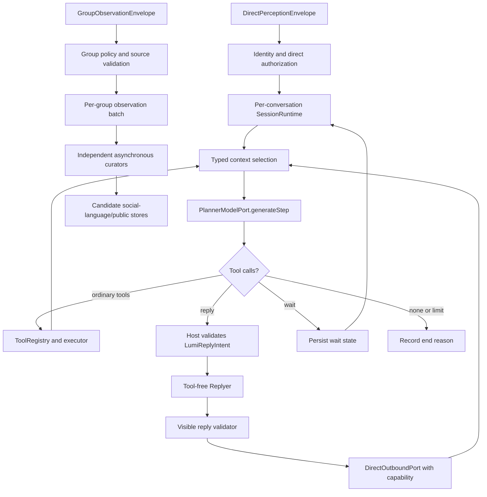

# MaiBot Clean-Room Architecture Mapping

This document records architecture concepts observed in the local read-only
`MaiBot-main` snapshot and the independently designed Lumi implementation
boundaries derived from those concepts.

It is not a source-porting guide. Lumi must not import, execute, package,
symlink, or copy source, prompts, comments, or tests from the reference tree.

## Reference Snapshot

- Local directory: `MaiBot-main/`
- Package version: `1.1.0` from `MaiBot-main/pyproject.toml`
- Configuration schema version: `8.14.33`
- Model configuration version: `1.17.6`
- License observed in the snapshot: GPL-3.0
- Git commit: unavailable because the supplied snapshot has no `.git`
  metadata
- Inspection date: 2026-07-26

The existing root-level `MAIBOT_ARCHITECTURE_ANALYSIS.md` was used only as an
index. The mappings below were checked against the current snapshot's runtime
source.

## Clean-Room Rules

1. Reference files are read-only and excluded by `.gitignore`.
2. Lumi code owns its own names, TypeScript contracts, prompts, algorithms,
   tests, persistence, and platform adapters.
3. Architectural behavior may be reproduced only from independently written
   requirements in the Lumi specification.
4. Prompt wording is never copied. Lumi prompt templates use its own persona,
   safety model, private-chat boundary, and output protocol.
5. The reference tree is absent from workspace manifests, package exports,
   build inputs, installer resources, archives, and release artifacts.

## Observed Architecture to Lumi Design

| Observed concept | Reference evidence | Independent Lumi implementation |
| --- | --- | --- |
| Per-session long-lived agent runtime | `src/maisaka/runtime.py`: `MaisakaHeartFlowChatting` owns history, queues, wait state, interrupt state, tool discovery, and learners | `packages/lumi-agent-runtime/src/runtime/session-runtime.ts` owns one direct conversation and exposes no platform state |
| Host-managed reasoning rounds | `src/maisaka/reasoning_engine.py`: `MaisakaReasoningEngine.run_loop` and round helpers | `ReasoningEngine` repeatedly invokes a single-step `PlannerModelPort`, executes declared tools, and records typed results |
| Model request service separate from runtime | `src/maisaka/chat_loop_service.py`: `MaisakaChatLoopService.chat_loop_step` builds one request and returns structured response data | `PlannerService.generateStep` builds one stable request and never runs a provider-owned tool loop |
| Planner cannot directly speak | `src/maisaka/builtin_tool/reply.py`: a dedicated tool invokes a reply generator and sends its result | Lumi exposes a `reply` ToolSpec; only that tool receives a direct outbound capability |
| Reply generator separated from planning | `src/chat/replyer/maisaka_generator_base.py`: reply context, history filtering, final request construction, retry constraints | `ReplyerService` receives a strict projection containing real dialogue, authorized references, a validated `LumiReplyIntent`, and no tools |
| Typed context roles | `src/maisaka/context/messages.py`: session-backed, assistant, reference, and tool-result message classes | `LumiAgentContextMessage` is a discriminated TypeScript union for dialogue, planner, tool result, and reference records |
| Tool call/result history integrity | `src/maisaka/context/history.py` and `src/maisaka/context/planner_messages.py` normalize and retain planner/tool records | Lumi context compaction treats assistant tool calls plus matching results as one atomic segment |
| Runtime interrupt on new input | `src/maisaka/runtime.py`: `PlannerInterruptController` and message registration request an interrupt | Each direct session owns an `AbortController`, generation counter, pending input queue, and quiet-window restart |
| Explicit wait state | `src/maisaka/builtin_tool/wait.py` plus runtime wait bookkeeping | Lumi's wait tool persists call ID, start time, deadline, and wake state; new direct input or timeout resumes the Planner |
| Deferred tool discovery | `src/maisaka/builtin_tool/tool_search.py` and runtime discovered-tool tracking | `tool_search` returns matching deferred ToolSpecs without executing them; discovery expires with the relevant context segment |
| Unified tool registry and availability | `src/core/tooling.py` and provider registration in `src/maisaka/runtime.py` | `ToolRegistry` normalizes builtin, Tool Mesh, MCP, and plugin tools into one ToolSpec contract |
| Memory/profile queried as tools | `src/maisaka/builtin_tool/query_memory.py` and `query_person_profile.py` | Builtin query tools call injected `MemoryPort` and `IdentityPort`; returned references retain authorization and provenance |
| Behavior references affect planning | `src/learners/behavior_selector.py` and behavior insertion in `src/maisaka/reasoning_engine.py` | Relevant learned behavior is projected into Planner references, never directly into final visible history |
| Expressions affect final wording | `src/chat/replyer/maisaka_expression_selector.py` and replyer integration | At most three authorized expression candidates are selected for Replyer; they cannot override facts, privacy, or refusal |
| Independent learners and batch gates | `src/learners/expression_learner.py`, `jargon_learner.py`, and `behavior_learner.py` each own acquisition and validation | Group observations are routed to four independent curators with per-group FIFO batches and independent retry state |
| Evidence-checked learned records | Learner parsers preserve source identifiers and filter model proposals before storage | Lumi validates that all source IDs belong to the current group batch before writing candidate records |
| Emoji library lifecycle | `src/emoji_system/emoji_manager.py` owns collection, description, lookup, usage, banning, and maintenance | Lumi reuses its existing sticker library port, classifier, cooldown, send statistics, and management UI |
| Prompt/request observability | `src/llm_models/request_snapshot.py` and display/monitor modules | Lumi traces request metadata and redacted prompt snapshots only when private logging is explicitly enabled |
| Context restored after restart | `src/maisaka/runtime.py`: `_restore_recent_context_from_db` | `PersistencePort` restores dialogue, planner state, wait state, summary checkpoint, and generation metadata |

## Deliberate Lumi Differences

### Direct and group inputs are different APIs

The reference runtime supports both private and group chat behavior. Lumi is a
private-chat agent. Lumi therefore does not expose a shared chat envelope:

- `LumiAgentRuntime.ingestDirect(DirectPerceptionEnvelope)` may plan and send.
- `GroupObservationRuntime.observe(GroupObservationEnvelope)` may only enqueue
  learning evidence.

The group envelope contains no outbound channel, tool runtime, or direct
capability. This is a type-level and runtime security boundary rather than a
prompt instruction.

### Capability-gated outbound

Lumi's outbound operations require an opaque `DirectOutboundCapability` issued
after identity and direct-conversation authorization. Text, image, voice,
sticker, mention, and quote methods all reject a missing or mismatched
capability with `GROUP_OUTBOUND_FORBIDDEN` and emit a security audit event.

### Existing Lumi memory and privacy remain authoritative

Lumi keeps its existing memory scopes, visibility, sensitivity, status,
provenance, identity bindings, SQLite persistence, and vector worker. The new
runtime adapts those facilities through ports; it does not reproduce the
reference project's memory subsystem.

### Existing Tool Mesh remains authoritative

Lumi Tool Mesh continues to own risk level, confirmation, access scope,
execution mode, resource control, and audit behavior. The runtime adapts its
definitions into ToolSpecs and delegates execution instead of maintaining a
second executor.

### Group-only social-language acquisition

New expression, jargon, behavior, public-knowledge, and sticker-language
candidates may only originate from verified, allowlisted group observations.
Private conversations may update feedback on existing group-derived candidates
but cannot create new language candidates.

### Shared desktop/server runtime

The desktop Pinia store and the Node server become adapters around the same
`LumiAgentRuntime`. Non-Lumi AIRI cards remain on the existing
`ChatOrchestratorRuntime`.

## Target Lumi Call Flow

## Migration Boundaries

1. `legacy`: existing AIRI/Lumi orchestration sends the reply.
2. `shadow`: the new runtime may run read-only, with no outbound, memory writes,
   learning writes, or side-effect tools.
3. `maisaka`: the new runtime is the sole Lumi authority.

Legacy social-language parsing remains available while the reply tool migration
is in progress, but `withLumiSocialLanguagePipeline` and
`assistantResponseTransform` must leave the authoritative Lumi path before
`maisaka` becomes the default.

## Verification Checklist

- `git check-ignore MaiBot-main` succeeds.
- No workspace manifest includes `MaiBot-main`.
- No production import contains `MaiBot`, `src.maisaka`, or a path into the
  reference directory.
- Build and installer file lists exclude the reference directory.
- Lumi prompt templates contain independently authored wording.
- Direct/group separation and outbound capability are covered by compile-time
  contracts and runtime tests.
