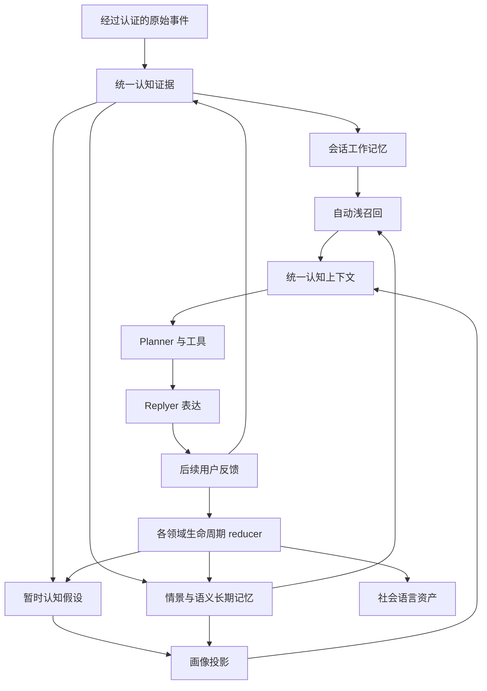

# Lumi 认知学习系统

## 目标与边界

Lumi 的认知系统把原始对话证据、工作记忆、暂时假设、长期记忆、用户画像投影、社会语言资产和反馈放进同一个可追溯生命周期。它不是一张万能表，也不是第二套人格或聊天历史。

系统保持以下语义边界：

- **证据**记录真实来源，不等于已经确认的事实。
- **工作记忆**记录当前会话的短期连续性，不等于长期画像。
- **暂时假设**允许 Lumi 使用不确定判断，但必须标注不确定性。
- **长期记忆**保存经过宿主分类的情景或语义内容。
- **画像投影**是稳定认知的物化视图，不能反向充当新证据。
- **社会语言资产**影响表达与互动方式，不授予事实或记忆访问权限。



共享纯逻辑位于 `packages/lumi-runtime/src/cognitive/`。Electron 主进程和 Lumi Server 分别实现持久化、ACL、向量服务和系统资源边界，Renderer 只读取经过投影的结果。

## 不可变身份与权限

每轮在入口处解析一次 `LumiCognitiveIdentity`：

```text
actorId + personaId + conversationId + conversationType + participantUserIds
```

随后整个快循环都使用这份不可变身份。桌面 `activeUserId` 只用于 UI 选择，不参与远程并发会话的权限判断。

记忆仍使用 `global`、`shared`、`relationship`、`group` 和 `private` 作用域。模型可以提出分类建议，但 `classifyLumiMemoryCandidate`、`canAccessLumiMemory` 和宿主持久化层会再次验证作用域、敏感度、所有者、参与者和会话类型。

群聊不进入当前直接对话认知快循环。群聊只能使用群时间线、Lumi 可公开的全局/共享记忆及当前群自己的 `group` 记忆，不注入任一参与者的私聊工作记忆、画像或 relationship/private 记忆。

## 统一证据

`LumiCognitiveEvidence` 定义于 `packages/lumi-runtime/src/cognitive/types.ts`。关键字段包括：

- `origin`: `primary`、`derived` 或 `legacy_import`。
- `sourceId` / `sourceMessageId`: 追溯到真实消息、工具调用或事件。
- `actorId` / `subjectUserIds`: 区分证据作者和被描述对象。
- `conversationType` / `participantUserIds`: 保留隐私边界。
- `scope` / `sensitivity`: 由宿主最终裁定的访问规则。
- `derivedFromEvidenceIds`: 派生结论的父证据，不允许伪装成独立原始证据。

当前用户消息由 `prepareLumiCognitiveTurn` 写成 `authorVerified=true` 的 primary evidence。Planner、Replyer、旧画像、旧 `current_state`、摘要和网页内容不会被当成高可信用户事实。旧数据迁移统一标记为 `legacy_import`。

桌面表结构由 `apps/stage-tamagotchi/src/main/services/airi/lumi-memory/cognitive.ts` 管理；服务器表结构由 `packages/lumi-server-runtime/src/database.ts` 管理。两端都保存证据主体、派生关系、反馈目标、假设证据和画像来源的关系表或等价 JSON 投影。

## 工作记忆

`LumiWorkingMemory` 以 `personId + personaId + conversationId` 隔离，包含：

- 活跃话题和话题栈；
- 实体与指代绑定；
- 当前目标、项目和未完成问题；
- 当前用户临时状态和关系情境；
- 续接点；
- 上一轮 `RecallState`；
- 来源消息、更新时间和过期时间。

`reduceLumiWorkingMemory` 进行确定性增量更新，不增加模型调用。`buildLumiContextualRecallQuery` 会识别“嗯”“对”“继续”等纯承接消息：在 RecallState 未过期且复用次数未超限时，直接复用上一轮查询和已授权记忆 ID，不重新生成无意义 embedding。带有新语义的短句会组合当前消息、最近完整 user/assistant 对话、活跃话题和上一轮查询生成新查询。

工作记忆与滚动上下文摘要职责不同：

| 层 | 作用 | 生命周期 |
| --- | --- | --- |
| 工作记忆 | 指代、活动目标、开放问题和本轮召回连续性 | 分钟到小时，逐项过期 |
| 滚动摘要 | 在模型上下文预算内保留更长时间线 | 按会话持久化，压缩时更新 |
| Episode | 把已压缩的一段真实对话变成可追溯情景记忆 | 长期，带消息范围与证据血缘 |

## 暂时认知与画像投影

`LumiBeliefHypothesis` 保存 predicate/value、支持和反证 evidence IDs、confidence、stability、TTL 及状态。`reduceLumiBeliefHypothesis` 区分一次观察、跨时间独立证据和用户明确纠正：

- 一次短期情绪只形成 tentative Daily 候选。
- 独立时间桶和独立原始证据会提高 stability。
- 派生摘要不会增加 independent evidence count。
- 用户纠正会把旧值降级或标记 contradicted，并建立新值。
- 过期或 contradicted 假设不会进入常规上下文。

`projectLumiCognitiveProfile` 从假设重建画像：

- Daily 可以投影仍有效的当前状态，并保留 expiry 和 evidence lineage。
- Dynamic 需要更高置信度、稳定度和独立证据。
- Core 需要跨时间稳定证据；高影响或受保护冲突进入 pending。

旧的 `recentTopics -> dynamic.current_focus 0.68` 一类固定置信度复制不再是认知主链路。`current_state` 设置页现在只读显示宿主拥有的 Working Memory 投影；认知桥启用时，旧写入口不会覆盖它。

## 长期记忆与冲突

`LumiMemoryFragment` 继续区分情景事件、用户事实、偏好、承诺、项目上下文和 Lumi 自我事实，并补充：

- `derivedFromEvidenceIds`；
- `validFrom` / `validUntil` / `lastConfirmedAt`；
- `supersedesId` / `supersededById` / `contradictsIds`；
- Episode 消息范围；
- `useCount` / `lastUsedAt`；
- `evidenceOrigin`。

明确纠正经过 `consolidateMemoryIntoCognition` 或服务器等价路径后，会让旧的 evidence-backed 当前记忆变为 contradicted/superseded，并把新记忆设为当前值。上下文组装和按 ID 重载都会再次排除 inactive、expired 或 superseded 记录。

上下文压缩完成后，`createLumiConversationEpisode` 把被压缩消息范围及其 primary evidence 组织成 derived conversation episode。该操作幂等，不删除原消息，也不把摘要文本提升为原始证据。

## 统一反馈总线

`LumiFeedbackEvent` 由可信宿主信号或明确用户文本生成。当前种类包括称赞、拒绝、事实纠正、自然/AI 味反馈、复述、话题继续/切换、工具成功/失败和决定确认/撤销。

`classifyExplicitLumiFeedback` 不把普通“嗯”视为正反馈。反馈通过稳定 target IDs 指向上一条实际回复所使用的表达、行为或认知资产；各领域 reducer 独立更新自己的计数和状态，同一事件不会把“这次说得自然”直接泛化成“用户永远偏好短回复”。

社会语言学习仍保留 `observed -> understood -> trial -> adopted -> habit -> forgotten` 生命周期。它消费统一反馈，但 ownership 和 affinity 只影响选择概率，不影响记忆 ACL。Lumi 自己重复输出同一句话不能无限强化 ownership。

## 自动浅召回与主动深搜

`prepareLumiCognitiveTurn` 在 Planner 前自动执行一次有上限的浅召回：

```text
verified user message
  -> contextual query or RecallState reuse
  -> host structured/lexical/semantic retrieval
  -> ACL and current-validity validation
  -> threshold/conflict filtering
  -> 0..5 authorized memories
  -> CognitiveContextBundle
  -> Planner
```

没有可靠结果时注入零条。`lumi_memory_search` 仍是主动深搜工具，用于精确历史追溯、更广时间范围和自动召回不足的情况。深搜和浅召回共享宿主 ACL，不允许 Planner 绕过身份边界。

桌面和服务器都使用 FTS/词法候选、常驻 Python embedding Worker 与 USearch 2.26.0 持久 HNSW 索引。SQLite 是记忆正文、embedding、ACL、证据、生命周期和索引变更序列的权威；USearch 只保存碰撞安全的数值键与向量。后台回填按页扫描全部可访问记忆，不再截断到最近 800/5000 条；交互检索不会触发大规模回填。ANN 返回的候选必须回到 SQLite 重新校验身份、作用域、状态、有效期、supersession 和内容摘要，失败或超时则降级到结构化/词法检索。

## 统一上下文与 Planner / Replyer

`assembleLumiCognitiveContext` 是唯一认知上下文组装器。它再次执行 ACL、去重、有效期、supersession 和群聊过滤，然后输出 `LumiCognitiveContextBundle`。

Planner 通过 `formatLumiPlannerCognitiveContext` 看到：

- 工作记忆；
- 稳定事实和相关 Episode；
- 明确标记“暂时、不确定、不可当作事实”的假设；
- 画像投影、关系、当前情绪和冲突；
- 授权工具结果及召回状态。

Replyer 通过 `projectLumiReplyerCognitiveContext` 只看到 Planner 的结构化意图、情绪、社会行为、互动策略和表达候选，不获得工具，也不直接修改记忆或画像。

服务器由 `createServerCognitiveContextPort` 接入 `LumiAgentRuntime`。桌面由 `createLumiDesktopCognitiveService` 经过 Electron 主进程桥接同一共享快循环。AstrBot 消息先由服务器绑定外部身份，再进入相同的服务器 Agent Runtime，不在插件内建立第二套意识或记忆。

## 快、中、慢循环

### 快循环

每轮由 `prepareLumiCognitiveTurn` 写入 primary evidence、更新工作记忆、复用或运行浅召回、记录明确反馈、组装上下文并交给 Planner。它不新增模型调用。

### 中循环

上下文压缩或稳定会话边界调用 Episode consolidation，保留被压缩消息的证据范围；记忆 curator 的候选通过宿主分类和证据校验后，更新假设、冲突和画像投影。

### 慢循环

桌面后台维护和服务器定时任务调用 `maintainLumiCognitiveState`，执行衰减、过期、假设降级、画像重建、旧工作记忆清理和社会语言维护。维护按身份分区运行，不阻塞正常回复。

## 持久化、迁移与删除

桌面迁移位于 `cognitiveMigration.ts`，服务器迁移位于 `database.ts`。旧画像、current state 和记忆使用 `copy -> verify -> activate`：复制成 `legacy_import`，核对数量和身份后才激活迁移标记；中断后可以继续，不破坏旧数据。

认知表、长期记忆和 SQLite 向量记录进入完整备份。导入会验证身份、证据引用、父血缘和记录数量，并为旧向量补齐确定性的 ANN key。`.usearch` 文件不进入备份，因为它不是正文权威；恢复、缺失、模型变化或索引损坏时会从 SQLite embedding 记录原子重建。

用户删除按 actor 执行原子事务，删除该 actor 的证据、工作记忆、假设、反馈、画像投影、长期记忆、关联向量及旧 person state，同时保留身份绑定和消息时间线。外键会阻止删除被其他人物合法认知引用的证据，避免静默破坏跨人物来源；其他人物的数据不受影响。

## 可观测性

自动召回 trace 记录：是否运行、查询原因、RecallState 复用、ACL 前后数量、词法/语义/合并/重排数量、阈值与冲突淘汰、注入数量、总耗时、embedding 耗时、向量状态和降级原因。

Prompt 日志默认关闭。关闭时审计只保存计数、状态和原因，不保存查询正文；开启后才允许在本地 Prompt 检查器中记录完整查询和认知投影。画像投影保留 belief/evidence IDs，反馈保留 target IDs，便于从 UI 或备份数据追溯变化来源。

## 调试与测试

### 桌面端语义索引管理

桌面端在“设置 -> 记忆与认知 -> 长期记忆”的“语义记忆索引”区域显示当前宿主返回的权威状态：

- `已索引 / 总数 / 缺失` 表示 SQLite 中 embedding 与当前记忆签名的匹配情况；
- `全局 HNSW` 表示宿主 USearch 持久索引是否已经追上 SQLite 修订序列；其条目数覆盖宿主中的全部向量，而“已索引 / 总数”按当前身份的可访问范围统计，因此多用户环境下两者不要求相等；
- `维度 / 修订` 用于确认 embedding 维度和最后应用的数据库变更序列；
- `Embedding 模型`、`Worker` 和设备用于定位模型未加载、CPU/CUDA 选择或 Worker 退出；
- `服务状态` 为“词法回退”时，聊天仍可使用 FTS/词法记忆，但不会伪装成语义索引已就绪。

刷新图标只重新读取状态，不生成 embedding。“补全并重建”会分页扫描当前身份可访问的全部非拒绝记忆，为缺失或已变化的记录生成 embedding，然后增量同步或原子重建 USearch。该操作在后台运行；聊天期间的交互式检索不会自行触发全量回填。

正常完成时应同时满足：缺失为 `0`、全局 HNSW 显示“已同步”、Worker 为“运行中”且服务状态为“可用”。单用户数据集里 HNSW 条目数通常等于已索引数量；多用户或共享记忆环境中，全局 HNSW 条目数可以更大。若索引文件缺失、损坏、模型/维度或 USearch 版本不兼容，点击“补全并重建”即可从 SQLite 权威向量恢复，不需要删除长期记忆数据库。

核心验证命令：

```powershell
pnpm -F @proj-airi/lumi-runtime exec vitest run src/cognitive
pnpm -F @proj-airi/lumi-server-runtime exec vitest run
pnpm -F @proj-airi/stage-tamagotchi exec vitest run src/main/services/airi/lumi-memory/cognitive.test.ts
pnpm -F @proj-airi/stage-ui exec vitest run src/stores/lumi-memory.multi-user.test.ts src/stores/lumi-current-state.multi-user.test.ts
pnpm -F @proj-airi/lumi-runtime typecheck
pnpm -F @proj-airi/lumi-server-runtime typecheck
pnpm -F @proj-airi/stage-ui typecheck
pnpm -F @proj-airi/stage-tamagotchi typecheck
D:\anaconda3\python.exe -m unittest services/lumi-memory-vector/test_server.py
```

重点回归场景包括：多用户和群聊隔离、低信息承接、assistant 指代继承、话题切换、假设 TTL/纠正/晋升、画像来源、supersession、反馈路由、备份恢复、用户删除、并发身份和 AstrBot 统一链路。
