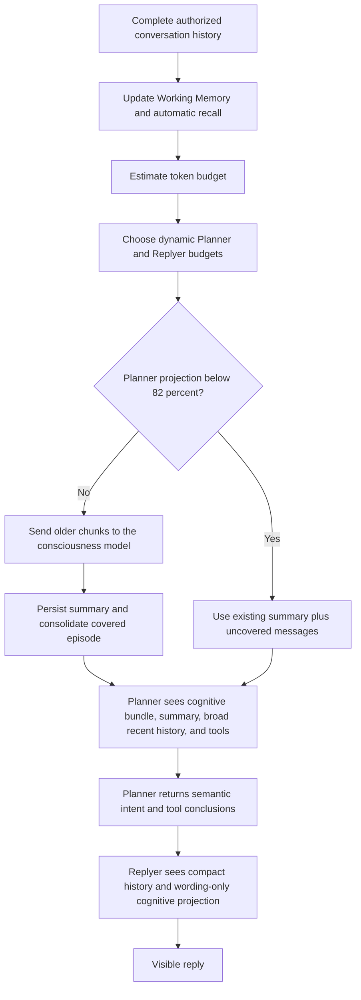

# Lumi Context Continuity

Lumi keeps long conversations through two complementary layers: a deterministic
conversation-scoped Working Memory for immediate continuity, and a token-aware
rolling summary for model context pressure. Message-count slicing is disabled
for Lumi conversations.

## Working Memory and rolling summaries

Working Memory is owned by the cognitive host and keyed by immutable
`actorId + personaId + conversationId`. It tracks active topics, entity
bindings, goals, projects, open loops, temporary user state, continuation point,
and the previous automatic memory `RecallState`. It is updated incrementally on
every verified direct turn without another model request.

Pure acknowledgements such as `嗯`, `对`, and `继续` reuse the previous
RecallState and assistant continuation context while it remains valid. A short
message with new semantics builds a new query from the current message, recent
complete user/assistant turns, active topics, and the previous query.

The rolling summary serves a different purpose: it preserves older chronology
when native messages would exceed the active Planner budget. It never replaces
Working Memory, and neither projection deletes the original timeline. When a
summary advances, the host may also consolidate the covered primary evidence
into an idempotent `conversation_episode` memory with the exact source message
range.

## Provider ceiling and active budgets

- Provider context ceiling: up to `1,000,000` tokens
- Output and reasoning reserve: `64,000` tokens
- Persona, memory, state, and tools reserve: `32,000` tokens
- Compression trigger: 82% of the remaining input budget
- Compression target: 68% of the remaining input budget
- Preferred recent verbatim window: 48 messages
- Minimum recent verbatim window under exceptional pressure: 8 messages
- Summary chunk size: 120,000 estimated tokens

The provider ceiling is not a per-request target. Lumi derives two active
budgets from the current authorized history size:

- **Planner:** a broad, dynamically growing semantic window, including normal
  tool access and the rolling summary.
- **Replyer:** a smaller wording window containing the rolling summary, newest
  native user/assistant turns, structured Planner intent, and the expression,
  behavior, and jargon candidates selected for this turn.

The Planner active history grows gradually and is capped at roughly 256K
estimated history tokens. The Replyer verbatim history grows gradually between
roughly 24K and 64K. Original messages remain persisted even when they are not
in the active request.

DeepSeek documents a 1M context window and up to 384K output for its current V4 models:

- <https://api-docs.deepseek.com/zh-cn/quick_start/pricing/>
- <https://api-docs.deepseek.com/zh-cn/api/create-chat-completion/>

DeepSeek context caching is automatic. Lumi therefore keeps stable persona and continuity prefixes whenever possible:

- <https://api-docs.deepseek.com/zh-cn/guides/kv_cache/>

## Flow

The summarizer must preserve speakers, chronology, unresolved questions, promises, corrections, emotional changes, decisions, and privacy scope. It may not invent facts. Original stored messages are not deleted.

## Storage

- Offline desktop summaries are stored per local chat session by `useLumiMainTimelineStore`.
- Online summaries are stored per server conversation in `lumi_conversation_summaries`.
- Online summaries are included in full server backups.
- Direct-chat and group summaries never share a key or projection.
- Working Memory is persisted independently per actor, Lumi persona, and conversation.
- Group conversations do not inherit a participant's direct Working Memory.
- Consolidated episodes retain evidence lineage and the covered message range.

## Settings

- Desktop: **Settings -> Language and Expression -> Context**
- Server: **Lumi Server Manager -> Models and Consciousness -> Consciousness Parameters**

Changing a budget affects future model projections. Clearing a summary causes Lumi to rebuild it from the retained original timeline when compression is next required.

## Consciousness request inspector

When **Record consciousness requests and prompts** is enabled under
**Settings -> Language and Expression -> Prompt**, the desktop runtime records
each Planner, Replyer, expression-selection, learning, memory, relationship,
and context-summary request. The inspector shows streamed output, first-token
latency, total duration, estimated token counts, and effective output speed.

Only a request labeled **Context compression** means the rolling summarizer
actually ran. Normal turns below the adaptive Planner threshold do not invoke
it. Planner and Replyer request records also include the selected context
budget and the number of retained or omitted native history messages.
Recent request details are retained locally; older entries keep timing metadata
while their full prompts are removed to bound browser storage.
