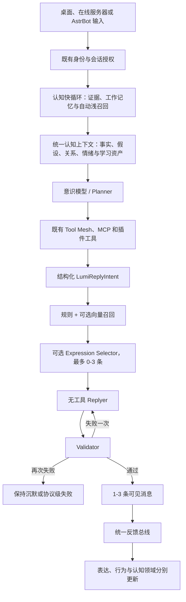

# Lumi 自然语言与社会语言学习系统

## 目标与边界

这套系统让 Lumi 在不改变持续人格、事实、权限、关系态度、情绪和防御决定的前提下，逐渐形成有生活历史的自然表达。它不是第二套人格，也不是 AstrBot 风格层。

优先级固定为：

```text
安全与授权
> 防御和拒绝
> 人格与关系态度
> 当前情绪
> 语义事实和工具结果
> 社会行为
> 表达习惯
> 最终措辞
```

语言亲和度只影响表达选择概率，绝不授予记忆访问权。Doggy 的一句口癖可以逐渐成为 Lumi 的表达，但该口癖来源会话中的私聊事实不会随之扩散。

## 运行链路



核心实现：

- `packages/lumi-runtime/src/social-language/types.ts`：协议、配置、表达、黑话、行为、日志和快照。
- `packages/lumi-runtime/src/social-language/prompts/planner.ts`：追加到既有意识提示的 Planner 合同。
- `packages/lumi-runtime/src/social-language/prompts/replyer.ts`：保持原生 `user` / `assistant` 历史的 Replyer 消息排列。
- `packages/lumi-runtime/src/social-language/pipeline.ts`：召回、可选精排、Replyer、重试、验证和回退。
- `packages/lumi-runtime/src/social-language/learning.ts`：可信来源过滤、表达/黑话/行为学习、反馈和衰减。
- `packages/lumi-runtime/src/social-language/selection.ts`：语义、向量、亲和度、ownership、反馈、场景和重复度评分。
- `packages/lumi-runtime/src/social-language/validator.ts`：拒绝、反对、愤怒、隐私、内部协议和助手套话保护。

## 与原系统的整合

### 桌面离线 Lumi

`packages/stage-ui/src/stores/chat.ts` 仍使用原有 `llmStore.stream` 和完整工具集合。工具执行完成后，原模型最终文本被解释为 `LumiReplyIntent`；`packages/core-agent/src/runtime/chat-orchestrator-runtime.ts` 在此期间缓冲 Planner 文本，防止 JSON 出现在 UI。随后使用相同 Provider 发起一次 `supportsTools=false` 的 Replyer 调用。

原有 `lumi-emotion`、关系门控、Persona 卡、记忆上下文和工具确认均保持原位置。新模块只读取它们的投影，不维护平行状态。

认知主链由 `packages/lumi-runtime/src/cognitive/` 共享实现。桌面主进程在 Planner 前写入可信证据、增量更新 Working Memory、运行自动浅召回并组装唯一的 `LumiCognitiveContextBundle`。Planner 接收事实、暂时假设、Episode、画像、关系、情绪和行为策略；Replyer 只接收 Planner 意图及措辞所需的行为、表达和情绪投影，不能执行工具或写入认知数据。

离线快照保存在桌面 Lumi SQLite 的 `lumi_social_language_snapshot` 表。`localStorage` 只作为 IPC/SQLite 暂不可用时的恢复层。

### Lumi Server

`packages/lumi-server-runtime/src/consciousness.ts` 在服务器授权记忆投影之后执行同一管线。在线客户端永远看不到 Planner JSON，也不能传入 Person ID 改写语言归属。

服务器以 `lumi_social_language_snapshot` 为唯一在线权威，并纳入 `lumi-server-backup:v1`。不同会话可以并发生成；每个决策和学习阶段写入前重新读取最新快照，避免跨会话最后写入覆盖。

服务器启用向量服务时，表达召回复用 `LumiVectorWorker` 的同一 Python/GPU 进程和模型缓存。关闭向量服务或向量失败时自动使用词法、场景和亲和度召回，不启动另一套 embedding 服务。

服务器认知快循环通过 `createServerCognitiveContextPort` 接入同一个 `LumiAgentRuntime`。自动召回、主动记忆深搜和社会语言 embedding 共用宿主向量服务，但 ACL、证据和生命周期仍以 SQLite 为权威。

### AstrBot 和工具

AstrBot 仍只负责平台输入输出。它提交的已绑定身份消息进入桌面或服务器原意识链路，因此自然语言学习、记忆授权和回复验证不会在插件中重复实现。

Planner 保留原 Tool Mesh、MCP、内置插件和工具确认语义。Replyer 明确禁用工具，只负责措辞，避免同一工具执行两次。

高相关度的社会行为会先以建议形式进入 Planner，影响参与、沉默、追问和目标消息选择；同一批行为也会进入 Replyer 影响长度与节奏。它们始终低于安全、授权、人格、关系和防御状态。

## 学习与生命周期

仅 `authorVerified=true` 且来源为真实 `chat` / `group_chat` 的证据进入学习。系统、工具、Planner、记忆摘要、网页、字幕、转发、代码、角色扮演和未知作者均被排除。

每条表达保存：

- 具体短语或抽象结构、场景、语用功能、情绪和类型。
- 人物、会话、平台、消息 ID 和 human/Lumi 来源。
- 全局与局部 affinity。
- familiarity、ownership、confidence。
- 观察、使用、成功、尴尬和明确拒绝计数。
- 首次/最近观察和使用时间、向量及生命周期状态。

新表达从 `observed` 候选开始，候选不会直接参与回复。第二次独立观察后进入 `understood`，才有资格进入召回。此后生命周期由真实使用效果推进：

- `trial`：至少一次成功反馈，且 ownership 与 familiarity 均达到试用阈值。
- `adopted`：至少两次成功反馈，且 ownership 与 familiarity 达到稳定采用阈值。
- `habit`：至少三次实际使用和三次成功反馈，ownership 不低于 `0.55`，familiarity 不低于 `0.5`。
- `forgotten`：累计三次明确拒绝，或在每日维护中因长期未见未用而自然衰减到遗忘阈值。

普通续聊只记为“已有后续反馈”，不会自动增加 ownership。明确称赞、复述 Lumi 的说法、继续玩梗才算正向证据；明确拒绝、误解和 AI 味投诉会降权。高 ownership 习惯衰减更慢，且桌面与服务器至多每日运行一次衰减，避免每条消息重复扣减。

这些信号现在同时进入统一 `LumiFeedbackEvent`。表达、社会行为、互动策略、用户认知、项目状态、长期记忆和关系 reducer 可以消费同一事件，但各自保留独立晋升规则。稳定 target IDs 记录上一条实际使用的资产；画像或 Lumi 自己的输出不会因为被系统再次读取就形成新的独立证据。

与 MaiBot 一次收集至少十条真实消息后批量抽取不同，Lumi 需要同时服务桌面、在线服务器与 AstrBot，因此保留逐条收集，但采用相同的“候选池 + 重复计数 + 活跃时间 + 少量选择”原则。一次性模型判断只负责提出候选，不能让表达直接成为习惯。

Lumi 自己的输出以 `source=lumi` 记录为低 ownership 候选。后续被称赞、复述或顺着玩梗时才明显提升，防止自我循环放大。

## 配置

桌面入口：`设置 -> 语言与表达`。

服务器入口：`lumi-server.json` 的 `languageLearning`。旧配置由 `upgradeLumiServerConfig` 自动补齐。

```json
{
  "languageLearning": {
    "enabled": true,
    "expressionLearningEnabled": true,
    "behaviorLearningEnabled": true,
    "jargonLearningEnabled": true,
    "selfExpressionLearningEnabled": true,
    "globalDiffusionEnabled": true,
    "maxSelectedExpressions": 3,
    "vectorCandidateLimit": 24,
    "preciseSelectorEnabled": false,
    "feedbackLearningEnabled": true,
    "promptLoggingEnabled": false,
    "multiMessageReplyEnabled": true
  }
}
```

`preciseSelectorEnabled=false` 时每轮通常是 Planner + 一次 Replyer。只有 Validator 失败才重试一次。开启精排会增加一次模型调用。学习 curator 只在有值得学习的文本时运行，失败不阻断回复。

`promptLoggingEnabled` 默认关闭。开启后日志输出决策 ID、表达 ID、选择原因、来源、ownership、affinity、行为 ID 和 Validator 结果；不默认打印可见正文。快照中的 Prompt 回放数据可能含上下文，应按私人数据处理。

## 回放与验证

运行脱敏回放：

```powershell
pnpm run lumi:language-replay
```

它比较：

1. 原始旧回复。
2. 仅 Replyer。
3. Replyer + 表达学习。
4. Replyer + 表达学习 + 行为学习。

核心测试覆盖可信来源、口癖/节奏、黑话、局部扩散、ownership、原创表达反馈、严肃场景降权、空选择、行为匹配、衰减、强制拒绝、反对、隐私、Planner JSON、双阶段重试、多消息、并发服务器写入和备份恢复。

## MaiBot 参考与差异

本轮生命周期校正重新核对了 MaiBot `974e9a1d50905f29b895d6a1ef57902b3a5e5419`。参考了其 Planner/`reply`/Replyer 分层、`maisaka_generator_base.py` 的消息排列、`maisaka_expression_selector.py` 的少量表达选择，以及 `expression_learner.py` 的批量学习、来源过滤、`situation + style + count + last_active_time` 累积模型。Lumi 保留了自身更完整的后续反馈、ownership、关系亲和度和明确拒绝机制。

本实现没有复制麦麦人设或 Prompt 原文，也没有让 Lumi 冒充人类。MaiBot 源码仅作为架构研究参考；Lumi 的实现是 TypeScript 原生模块，并继续服从本项目 MIT 许可和现有身份/隐私模型。完整源码研究见仓库根目录 `MAIBOT_ARCHITECTURE_ANALYSIS.md`。

## 已知限制

- 桌面和服务器都可复用常驻 Python embedding Worker；桌面认知召回会合并 FTS/词法和语义候选，社会语言选择也可接收同一宿主 embedding。当前持久向量检索仍在有限 SQLite 向量候选上执行 JSON 余弦扫描，尚未替换为可扩展 ANN 索引。
- 多消息在共享核心中以空行持久化，桌面与 AstrBot 已按现有拆分逻辑发送多气泡；`delayMs` 和 `quoteMessageId` 尚未在所有远端平台完整保真。
- Validator 是确定性保护层，不是形式化语义证明。高风险隐私仍以数据库授权投影和 Planner 的 immutable constraints 为第一防线。

统一认知层、反馈总线、迁移和调试方法详见 `docs/lumi/cognitive-learning-system.md`。
